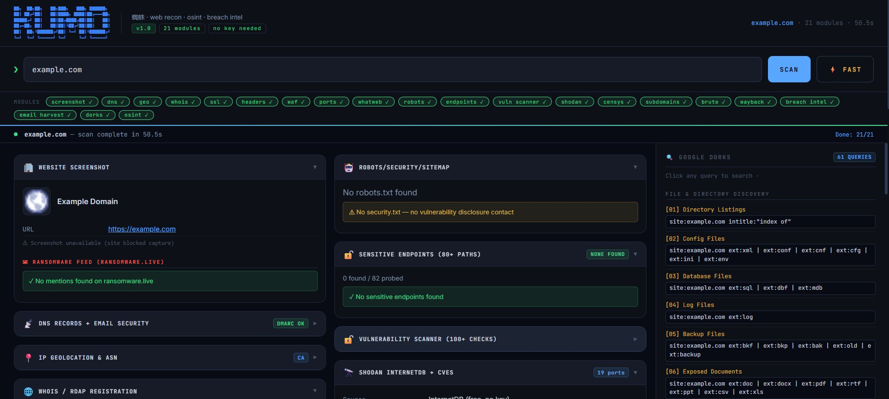
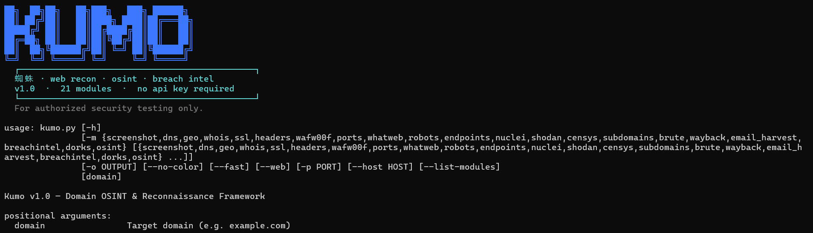

<div align="center">


<!-- fallback plain ASCII for viewers that block external images -->

```
██╗  ██╗██╗   ██╗███╗   ███╗ ██████╗
██║ ██╔╝██║   ██║████╗ ████║██╔═══██╗
█████╔╝ ██║   ██║██╔████╔██║██║   ██║
██╔═██╗ ██║   ██║██║╚██╔╝██║██║   ██║
██║  ██╗╚██████╔╝██║ ╚═╝ ██║╚██████╔╝
╚═╝  ╚═╝ ╚═════╝ ╚═╝     ╚═╝ ╚═════╝
```

**蜘蛛 — it crawls. you watch.**

[](https://python.org)
[](.)
[](.)
[](.)
[](LICENSE)

**One domain. One command. Everything.**

</div>

---

Kumo is a domain OSINT & security reconnaissance framework. Drop a domain — get everything back in real time across **21 parallel modules**: DNS, open ports, leaked credentials, infostealer infections, vulnerable endpoints, subdomains, CVEs, malware families, and more.

```bash
pip install requests flask

python3 kumo.py target.com          # full CLI scan
python3 kumo.py target.com --fast   # fast mode (skips slow modules)
python3 kumo.py --web               # web UI → http://localhost:8888
```

---

## Screenshots

**Web UI** — 21 modules streaming in real time, results on the right, Google Dorks panel on the side:



**CLI** — the KUMO banner on launch:



---

## Modules

---

### 🖼️ Screenshot — Website overview

Takes a live screenshot of the target and runs it against the **ransomware.live** feed. Pulls the page title, meta description, favicon, CMS fingerprint, and checks whether the domain appears in any ransomware gang's leak posts.

```
  URL         https://corp.com
  Title       Corp — Enterprise Solutions
  CMS         WordPress 6.4
  Favicon     ✓ found

  ☠ RANSOMWARE FEED
  ✓ No mentions found on ransomware.live
```

---

### 📡 DNS — Records + email security

Full DNS enumeration with a security grade on email protection. Detects missing DMARC, weak SPF policies, absent DKIM, and open zone transfers.

```
  A         203.0.113.10
  MX        mail.corp.com  (priority 10)
  NS        ns1.corp.com · ns2.corp.com
  TXT       v=spf1 include:_spf.google.com ~all

  EMAIL SECURITY
  DMARC     ✗ Missing — anyone can spoof @corp.com
  SPF       ⚠ Soft fail (~all) — not enforced
  DKIM      ✗ No selector found
```

---

### 📍 Geolocation — IP + ASN

Resolves the domain to IPv4/IPv6, geolocates each IP, and pulls ASN, ISP, and organization data.

```
  IP         203.0.113.10
  Country    🇺🇸 United States
  City       Ashburn, Virginia
  ASN        AS14618 — Amazon.com Inc.
  ISP        Amazon Web Services
```

---

### 🌐 WHOIS / RDAP — Registration data

Full registrar record including creation date, expiry, registrant info, and nameservers. Detects domains expiring soon and privacy-protected registrations.

```
  Registrar    GoDaddy LLC
  Created      2010-03-14
  Expires      2026-03-14  ← 337 days left
  Updated      2024-11-01
  Status       clientTransferProhibited
  Name servers ns1.corp.com · ns2.corp.com
```

---

### 🔒 SSL/TLS — Certificate analysis

Inspects the full certificate chain — issuer, expiry, Subject Alternative Names, cipher suite, and protocol version. Flags expired, self-signed, or misconfigured certificates.

```
  Subject     corp.com
  Issuer      Let's Encrypt — R11
  Valid from  2025-01-10
  Expires     2025-04-10  ← 89 days left
  SANs        corp.com · www.corp.com · api.corp.com · mail.corp.com
  Protocol    TLSv1.3  ✓
  Cipher      TLS_AES_256_GCM_SHA384  ✓
```

---

### 🛡️ HTTP Headers — Security grade

Checks every security-relevant response header and grades the configuration. Flags missing headers that leave the site open to XSS, clickjacking, MIME sniffing, and information disclosure.

```
  Grade   C

  ✗ Content-Security-Policy    missing — XSS risk
  ✗ X-Frame-Options            missing — clickjacking risk
  ✓ X-Content-Type-Options     nosniff
  ✗ Strict-Transport-Security  missing — HSTS not enforced
  ✗ Permissions-Policy         missing
  ✓ Referrer-Policy            no-referrer-when-downgrade
  ℹ Server                     nginx/1.24.0  ← version exposed
  ℹ X-Powered-By               PHP/8.1.2    ← stack disclosed
```

---

### 🧱 WAF Detection

Fingerprints the WAF or CDN sitting in front of the target using 40+ signatures — headers, cookies, server banners, and active probe responses. If nothing is detected, it says so clearly.

```
  Source   Python fingerprinter (40+ signatures)

  ✓ Probably no WAF/CDN detected
  Based on header, cookie and active probe analysis.
  Note: absence of WAF signatures does not guarantee no protection.
```

Or when detected:

```
  [HIGH]   Cloudflare
           cf-ray header · __cfduid cookie · CF-Cache-Status

  [LOW]    Akamai
           X-Check-Cacheable header
```

---

### 🚪 Port Scan — 70+ ports + banners

Scans 70+ common ports and grabs service banners for each open one. Enriched with data from Shodan and Censys when available.

```
  PORT     STATE    SERVICE     BANNER
  22/tcp   open     SSH         OpenSSH 8.9p1 Ubuntu
  80/tcp   open     HTTP        nginx/1.24.0
  443/tcp  open     HTTPS       nginx/1.24.0
  3306/tcp open     MySQL       5.7.42-log ← exposed to internet
  6379/tcp open     Redis       PONG       ← no auth required
  8080/tcp open     HTTP        Apache Tomcat/9.0.80
```

---

### 🕵️ WhatWeb — Technology fingerprinting

Identifies the full tech stack — CMS, frameworks, JavaScript libraries, analytics, CDN, server, and more. Runs 80+ signature checks without sending a single intrusive request.

```
  CMS           WordPress 6.4.3
  Server        nginx 1.24.0
  PHP           8.1.2
  Framework     jQuery 3.6.0
  Analytics     Google Analytics · Hotjar
  CDN           Cloudflare
  Fonts         Google Fonts
  SSL           Let's Encrypt
```

---

### 🤖 Robots / Security — Crawl rules + disclosure

Parses `robots.txt` for disallowed and allowed paths, highlights sensitive ones, and checks for a `security.txt` vulnerability disclosure contact. Also discovers sitemaps.

```
  ✓ robots.txt found (23 rules)

  ⚠ SENSITIVE DISALLOWED PATHS
  /admin/
  /wp-admin/
  /config/
  /backup/
  /.git/

  ✓ ALLOWED PATHS
  /api/public/
  /sitemap.xml
  /Darklord

  ✗ No security.txt — no vulnerability disclosure contact
```

---

### 🔓 Sensitive Endpoint Discovery — 80+ known paths

Probes 80+ paths that are commonly left exposed: admin panels, backup files, config files, debug interfaces, API docs, source control, and infrastructure files. Every hit is severity-graded. A `403 Forbidden` response still confirms the path exists and is automatically downgraded one severity level.

```
  12 found / 80 probed   CRITICAL: 2  HIGH: 4  MEDIUM: 5  LOW: 1

  CRITICAL  /.env                      200  ← credentials exposed
  CRITICAL  /WEB-INF/web.xml           200  ← Java config leak
  HIGH      /wp-admin/                 200
  HIGH      /phpmyadmin/               200
  HIGH      /docker-compose.yml        200
  HIGH      /.git/HEAD                 200
  MEDIUM    /api/swagger.json          200
  MEDIUM    /actuator/env              200
  MEDIUM    /.git/config [403]         403  ← exists, access denied
  LOW       /.htaccess [403]           403
```

---

### 🔓 Vulnerability Scanner — 130+ built-in checks

Pure Python, zero external tools. 130+ HTTP-based checks inspired by real Nuclei templates — covering known CVEs, CMS vulnerabilities, exposed admin panels, cloud metadata endpoints, CI/CD dashboards, CORS misconfigurations, and more.

```
  CRITICAL: 2   HIGH: 5   MEDIUM: 7

  CRITICAL  Log4Shell RCE (CVE-2021-44228)          200 — Confirmed
  CRITICAL  Laravel .env Exposed                    200 — Plaintext secrets
  HIGH      Git Repository Accessible               200
  HIGH      phpMyAdmin Public Access                200
  HIGH      Jenkins Dashboard (Unauthenticated)     200
  HIGH      AWS Keys in HTTP Response               200
  MEDIUM    Spring Boot Actuator /env               200
  MEDIUM    Grafana Default Credentials             200
  MEDIUM    Kibana Dashboard Exposed                200
```

Checks include: **Log4Shell · Spring4Shell · Drupalgeddon2 · Confluence OGNL · Oracle WebLogic · 15 WordPress plugin CVEs · CORS misconfiguration · Host header injection · Clickjacking · open redirects** and many more.

---

### 🔭 Shodan — InternetDB + CVE enrichment

Queries Shodan InternetDB (free, no key) for open ports, CPEs, hostnames, and CVEs. Every CVE is enriched with CVSS score, severity, KEV flag, and description via Shodan's free CVEDB API.

```
  Source   InternetDB (free, no key)
  Ports    22, 80, 443, 3306, 6379, 8080
  CVEs     4

  CVE-2021-44228   CVSS 10.0   CRITICAL   [KEV]   EPSS 0.9741
  Remote code execution via JNDI lookup in Log4j 2.x

  CVE-2022-26134   CVSS 9.8    CRITICAL   [KEV]   EPSS 0.9689
  Confluence Server OGNL injection — unauthenticated RCE

  CVE-2021-26084   CVSS 9.8    CRITICAL   [KEV]
  Confluence Server pre-auth remote code execution
```

---

### 🔬 Censys — Hosts + certificates

Pulls host data and certificate intelligence from Censys. Enriched with optional API key for full results.

```
  IPs      203.0.113.10 · 203.0.113.11
  Certs    14 certificates found in CT logs

  CERT     corp.com  (valid)      → Let's Encrypt  exp. 2025-04-10
  CERT     dev.corp.com  (valid)  → Let's Encrypt  exp. 2025-03-22
  CERT     old.corp.com  (expired)→ DigiCert       exp. 2022-08-01 ⚠
```

---

### 🗺️ Subdomain Discovery — 4 passive sources + CT logs

Queries **crt.sh**, **HackerTarget**, **RapidDNS**, and **AlienVault OTX** simultaneously, cross-references with Certificate Transparency logs, resolves every result, checks if it's alive, and flags anything that looks sensitive.

```
  Total found   52    Alive   34    ⚠ Sensitive   8

  SUBDOMAIN               IP                FLAG
  admin.corp.com          203.0.113.10      ⚠ SENSITIVE
  dev.corp.com            203.0.113.24      ⚠ SENSITIVE
  staging.corp.com        203.0.113.31      ⚠ SENSITIVE
  intranet.corp.com       203.0.113.45      ⚠ SENSITIVE
  vpn.corp.com            203.0.113.88      ⚠ SENSITIVE
  api.corp.com            203.0.113.55
  mail.corp.com           203.0.113.12
  shop.corp.com           203.0.113.78
  cdn.corp.com            203.0.113.92
  ...
```

---

### 🔨 Subdomain Brute Force

Tests thousands of common subdomain names via DNS with wildcard detection — eliminates false positives automatically. Finds subdomains that passive sources miss entirely.

```
  Wordlist     5000 names
  Threads      50
  Wildcard     ✓ detected and filtered

  NEW (not in passive)
  backup.corp.com         203.0.113.101   ⚠ SENSITIVE
  jenkins.corp.com        203.0.113.102   ⚠ SENSITIVE
  vault.corp.com          203.0.113.103   ⚠ SENSITIVE
```

---

### 📚 Wayback Machine — Archive mining

Queries the Wayback Machine for archived snapshots of the target — mining old endpoints, forgotten login pages, exposed config files, and paths that no longer exist on the live site but reveal the attack surface history.

```
  Snapshots    2,847
  Date range   2011-03-14 → 2025-01-09

  INTERESTING ARCHIVED PATHS
  /admin/old-login.php           (2019-08-22)
  /config/database.yml           (2021-03-10)
  /api/v1/debug/                 (2022-06-18)
  /backup/db_export_2020.sql     (2020-11-05)  ← backup exposed
  /.env.backup                   (2023-01-14)  ← secrets
```

---

### 💀 Breach & Credential Intelligence — 5 sources

Aggregates from **5 free sources** and runs an automatic per-email stealer check against Hudson Rock's database — showing which employee machines were infected, what malware ran, what passwords were stolen, and which services were compromised.

```
  ┌────────────────┬──────────────┬──────────────┬─────────────┐
  │     8024       │      12      │     183      │      6      │
  │  INFOSTEALER   │  EMPLOYEES   │   CLIENTS    │   EMAILS    │
  └────────────────┴──────────────┴──────────────┴─────────────┘

⚠ CRITICAL FINDINGS
  [hudsonrock] employees_infected_infostealer
               3 employee machines infected — last: 2025-03-14
  [hudsonrock] stealer_family_identified
               Primary malware: RedLine (3100 infections)
  [chiasmodon] employee_plaintext_password
               john@corp.com — pass: S3cr*** (2024-08-11)
  [proxynova]  comb_credentials_found
               183 unique emails with plaintext passwords

HUDSON ROCK CAVALIER
  Employees 3 · Clients 8017 · 3rd Parties 21 · Records 8041
  Malware: RedLine: 3100 · Lumma: 1540 · Raccoon: 892 · StealC: 401
  Last employee hit: 2025-03-14

CHIASMODON (pages 1+2)
  EMAIL                PASSWORD     DATE
  john@corp.com        S3c•••••    2024-08-11
  admin@corp.com       adm•••••    2024-11-02
  dev@corp.com         d3v•••••    2024-07-28

PROXYNOVA COMB (3.2B credentials)
  Records 247 · Emails 38
  billing@corp.com    bil*****   (len 11)
  info@corp.com       inf****    (len 8)

HAVEIBEENPWNED
  ✓ No domain breaches found (972 indexed)

☠ STEALER CHECK  (per-email · 9 infected / 20 checked)
  john@corp.com                                  ☠ INFECTED
  📅 2025-01-12   💻 JOHN-PC   🖥 Windows 10 Pro x64
  🦠 C:\Users\john\AppData\Roaming\update\svc.exe
  🔑 Passwords: S3cr***0 · c0rp***y · J0hn***!
  🏢 4 corp services stolen · 👤 89 personal
```

---

### 📧 Email Harvester

Discovers `@domain` employee email addresses across multiple open sources, then merges in every confirmed email found during the breach intelligence scan.

```
  Confirmed   7    Patterns   20
  Sources: crt.sh · web scraping · whois · DNS SOA · wayback

  📧 CONFIRMED EMAILS
  john@corp.com
  admin@corp.com
  dev@corp.com
  support@corp.com
  billing@corp.com

  💡 COMMON PATTERNS (may exist)
  info@corp.com  contact@corp.com  security@corp.com  hr@corp.com ...
```

Sources: **Hunter.io** · **crt.sh** certificate logs · web page scraping (contact / about / team) · **DNS SOA** record · **WHOIS** contact · **Wayback Machine** archive · common business prefixes.

---

### 🔍 Google Dorks — 61 queries

Generates 61 targeted Google dork queries pre-built for the domain — one click opens them in Google. Covers exposed files, login pages, sensitive directories, subdomains, cached pages, code repositories, and more.

```
  FILE EXPOSURE
  site:corp.com filetype:pdf
  site:corp.com filetype:xlsx OR filetype:csv
  site:corp.com filetype:sql OR filetype:bak
  site:corp.com ext:env OR ext:config OR ext:yaml

  LOGIN & ADMIN
  site:corp.com inurl:login OR inurl:admin OR inurl:dashboard
  site:corp.com inurl:wp-admin

  SENSITIVE CONTENT
  site:corp.com intext:"password" OR intext:"api_key"
  site:corp.com intext:"BEGIN RSA PRIVATE KEY"

  SUBDOMAINS & INFRA
  site:*.corp.com -www
  site:corp.com inurl:dev OR inurl:staging OR inurl:test

  ... 51 more queries across 8 categories
```

---

### 🔗 OSINT Platform Links — 26 sources

Pre-generates 26 investigation links for the target across the most useful OSINT platforms — one click and you're there.

```
  THREAT INTEL
  VirusTotal          https://virustotal.com/gui/domain/corp.com
  URLhaus             https://urlhaus.abuse.ch/browse/?search=corp.com
  Shodan              https://shodan.io/search?query=hostname:corp.com

  BREACH & LEAKS
  HaveIBeenPwned      https://haveibeenpwned.com/DomainSearch
  ProxyNova COMB      https://proxynova.com/tools/comb?query=@corp.com
  IntelX              https://intelx.io/?s=corp.com
  DeHashed            https://dehashed.com/search?query=corp.com
  LeakRadar           https://leakradar.io/search?q=corp.com
  HudsonRock          https://cavalier.hudsonrock.com/...

  RECON & MAPPING
  Shodan Maps         https://maps.shodan.io/#corp.com
  Censys              https://search.censys.io/search?q=corp.com
  Fofa                https://en.fofa.info/result?qbase64=...
  ZoomEye             https://zoomeye.org/searchResult?q=corp.com

  ... 13 more across threat intel, archive, and code search
```

---

## ⚙️ Optional API keys

Everything works without any key. These unlock richer data:

| Variable | Unlocks |
|----------|---------|
| `SHODAN_API_KEY` | Full Shodan host data — banners, services, full history |
| `CENSYS_API_ID` + `CENSYS_API_SECRET` | Full Censys host & certificate search |
| `HIBP_API_KEY` | Per-email HaveIBeenPwned lookup |
| `CHIASMODON_API_KEY` | Chiasmodon pro tier — more results |
| `RANSOMWARE_LIVE_API_KEY` | Ransomware.live pro feed |
| `GOOGLE_CSE_KEY` + `GOOGLE_CSE_ID` | Execute Google dorks live |

```bash
export SHODAN_API_KEY="your_key_here"
export HIBP_API_KEY="your_key_here"
# loaded at runtime — never hardcoded
```

---

## 📟 CLI reference

```
python3 kumo.py target.com                    full scan
python3 kumo.py target.com --fast             skip slow modules
python3 kumo.py target.com -m dns ssl ports   specific modules only
python3 kumo.py target.com -o report.json     export to JSON
python3 kumo.py --web                         web UI (port 8888)
python3 kumo.py --web -p 9000                 custom port
python3 kumo.py target.com --no-color         pipe-friendly output

fast mode skips: wayback · brute · subdomains · email_harvest
```

---

> ⚠️ **For authorized security testing only.**  
> Only scan domains you own or have explicit written permission to test.
> You are free to use, modify, and share this code for educational and personal purposes.
> Please give proper credit when using or referencing this work.
> Commercial use is not allowed without explicit permission from the author.
<div align="center">
<br>
<sub>Built for those who move fast. 蜘蛛.</sub>
</div>
