<p align="center">
  
</p>

<p align="center">


<a href="https://ko-fi.com/k0r1m"></a>
</p>

---

Give Kumo a domain and it maps everything reachable about it in one pass:
**DNS and email security**, **certificates and subdomains** from CT logs,
**open ports**, **technology fingerprints**, **leaked credentials** and
infostealer infections, **cloud buckets**, and **358 vulnerability checks**
against known exposures. Twenty-seven modules run in parallel, each one
streaming its own card the moment it lands — in the terminal or in the browser.

No API key is required for any of it.

```bash
pip install flask requests dnspython urllib3

python3 kumo.py                    # home screen — pick modules by number
python3 kumo.py --web              # web dashboard → http://127.0.0.1:8888
python3 kumo.py example.com        # straight to a full scan
```

<p align="center">
  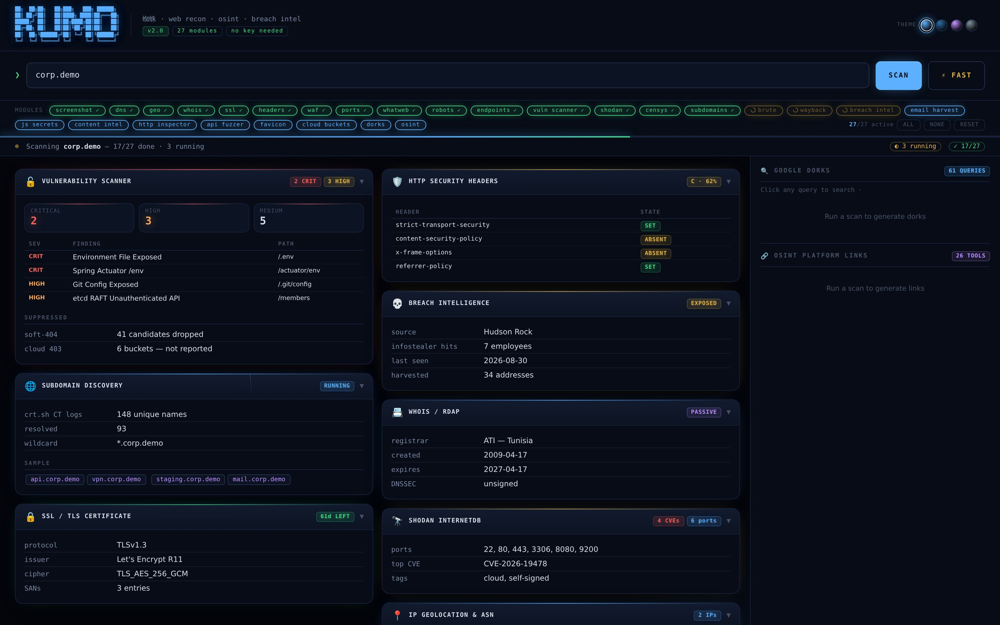
  <br><sub>The dashboard mid-scan: cards stream in as each module finishes,
  glowing by severity, with the vulnerability scanner leading on findings.</sub>
</p>

---

## 📑 Table of contents

- [Installation](#-installation)
- [Running your first scan](#-running-your-first-scan)
- [The terminal](#-the-terminal)
- [The dashboard](#-the-dashboard)
- [Themes](#-themes)
- [Vulnerability scanner](#-vulnerability-scanner)
- [Modules](#-modules)
- [Optional API keys](#-optional-api-keys)
- [CLI reference](#-cli-reference)
- [Tests](#-tests)
- [Credits](#-credits)
- [Ecosystem](#-ecosystem)

---

## 📦 Installation

### Requirements

| | |
|---|---|
| OS | Linux, macOS or Windows |
| Python | 3.8+ |
| Rights | none — Kumo never needs root |
| API keys | none required |

### Install

```bash
git clone https://github.com/karim852/KUMO-Domain-Recon-Tool
cd KUMO-Domain-Recon-Tool
pip install flask requests dnspython urllib3
```

Optional extras, each used by a single module and skipped cleanly when absent:

```bash
pip install brotli zstandard playwright
```

> **Nothing to configure.** There is no config file, no key file and no
> database. Kumo reads what it needs from public sources at run time.

---

## 🚀 Running your first scan

### Step 1 — Open the home screen

```bash
python3 kumo.py
```

With no target, Kumo opens its home screen: every module numbered and grouped,
with the web interface on top.

<p align="center">
  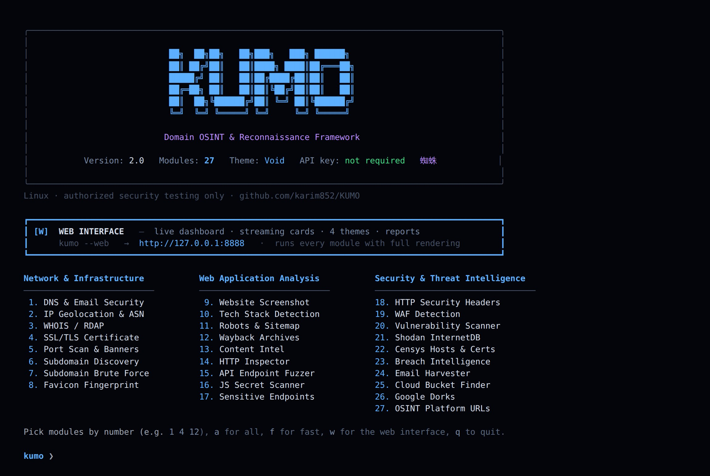
</p>

### Step 2 — Choose what to run

| Input | Runs |
|---|---|
| `1 4 12` | just those modules |
| `a` | all 27 |
| `f` | fast scan — skips the slow modules |
| `w` | the web dashboard |
| `q` | quit |

Then enter the domain when prompted. Or skip the menu entirely:

```bash
python3 kumo.py example.com -m dns ssl nuclei
```

### Step 3 — Watch the spider work

Modules run in parallel, so results do not arrive in order. A spider crawls the
strand while they run, spinning silk behind it as each one lands, with the
modules still in flight trailing the counter.

<p align="center">
  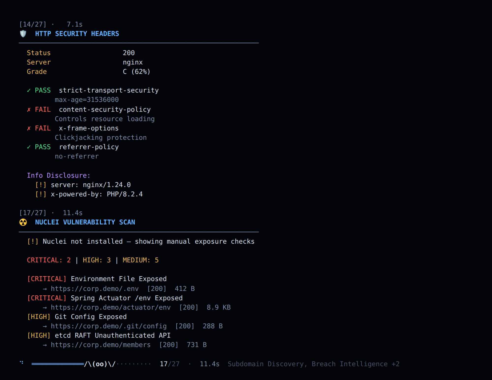
</p>

### Step 4 — Export

```bash
python3 kumo.py example.com -o report.json
```

---

## 🖥️ The terminal

The terminal is not a fallback — every module renders in full, with its own
layout, tables and severity colouring.

| | |
|---|---|
| Home screen | all modules numbered, grouped, sized to the terminal |
| Selection | by number, or `a` / `f` / `w` |
| Progress | spider crawl with live counter and in-flight module names |
| Themes | four palettes in 24-bit colour, `--theme` or `KUMO_THEME` |
| Piping | `--no-color` strips every escape sequence |

The module menu is generated from the module registry itself, so anything
registered always appears — a new module cannot silently go missing from the
list.

---

## 🌐 The dashboard

```bash
python3 kumo.py --web             # → http://127.0.0.1:8888
python3 kumo.py --web -p 9000     # custom port
```

The dashboard streams over SSE. Each module gets a card that appears
immediately, shows a rotating edge while it is still running, then fills and
takes on the colour of what it found — red for critical, amber for warnings,
green for clean.

| | |
|---|---|
| Streaming | cards arrive as modules finish, no waiting for the slowest |
| Severity glow | card colour is derived from the badges it renders |
| Module pills | click to enable or disable before scanning |
| Export | JSON, or a standalone HTML report |
| Themes | four, switchable live, remembered across reloads |

---

## 🎨 Themes

Four palettes, in both the dashboard and the terminal. Click a dot in the
header, or press <kbd>Ctrl</kbd>+<kbd>Shift</kbd>+<kbd>T</kbd> to cycle. The
choice is saved and survives a reload.

<p align="center">
  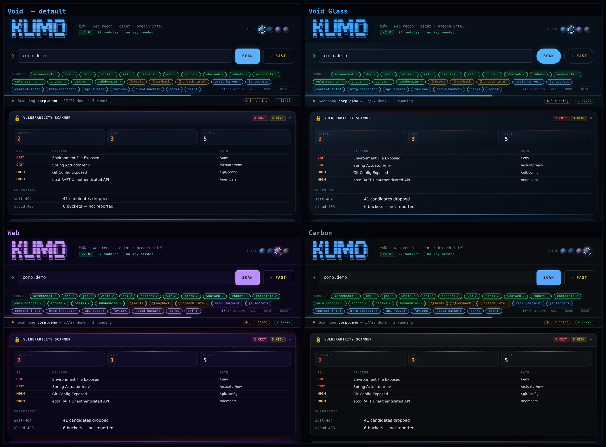
</p>

| Theme | Character |
|---|---|
| **Void** *(default)* | deepest navy, cyan bloom, flat surfaces |
| **Void Glass** | lit card edges, under-glow, larger radius |
| **Web 蜘蛛** | violet accent, strongest glow |
| **Carbon** | neutral surfaces, restrained glow — best for client screenshots |

In the terminal:

```bash
python3 kumo.py --theme carbon example.com
export KUMO_THEME=web
```

Adding a fifth theme is one palette block plus one dot — every renderer reads
its colours through the same token set.

---

## 🔓 Vulnerability scanner

**358 checks**, no external tool and no template directory to sync. The engine
mirrors nuclei's matcher model — `status`, `word`, `regex`, `size` and a small
`dsl`, combined with `matchers_condition`.

<p align="center">
  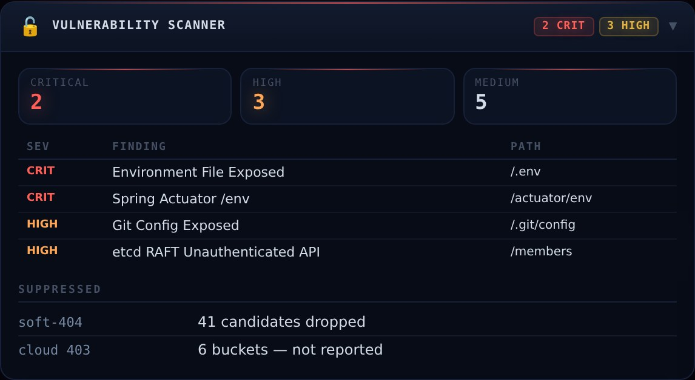
</p>

---

## 🧩 Modules

**27 modules**, every one running in parallel. Click a module to see what it returns on a real scan.

Run them by number from the home screen, or by name: `python3 kumo.py corp.demo -m dns ssl nuclei`

### Network & Infrastructure

<details>
<summary><b>📡 DNS — Records + email security</b> &nbsp;·&nbsp; <code>dns</code></summary>

Full DNS enumeration with a security grade on email protection. Detects missing DMARC, weak SPF policies, absent DKIM, and open zone transfers.

<p align="center">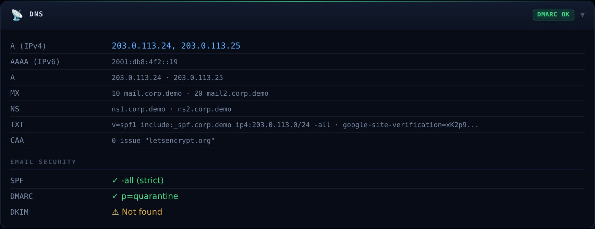</p>

</details>

<details>
<summary><b>📍 Geolocation — IP + ASN</b> &nbsp;·&nbsp; <code>geo</code></summary>

Resolves the domain to IPv4/IPv6, geolocates each IP, and pulls ASN, ISP, and organization data.

<p align="center">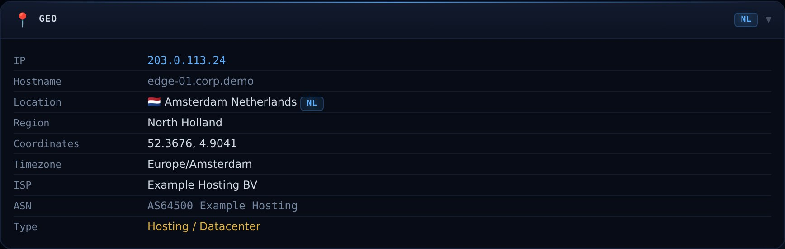</p>

</details>

<details>
<summary><b>🌐 WHOIS / RDAP — Registration data</b> &nbsp;·&nbsp; <code>whois</code></summary>

Full registrar record including creation date, expiry, registrant info, and nameservers. Detects domains expiring soon and privacy-protected registrations.

<p align="center">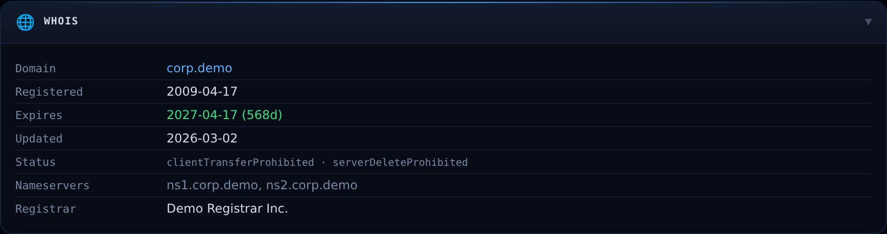</p>

</details>

<details>
<summary><b>🔒 SSL/TLS — Certificate analysis</b> &nbsp;·&nbsp; <code>ssl</code></summary>

Inspects the full certificate chain — issuer, expiry, Subject Alternative Names, cipher suite, and protocol version. Flags expired, self-signed, or misconfigured certificates.

<p align="center">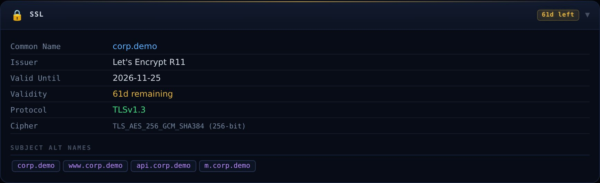</p>

</details>

<details>
<summary><b>🚪 Port Scan — 70+ ports + banners</b> &nbsp;·&nbsp; <code>ports</code></summary>

Scans 70+ common ports and grabs service banners for each open one. **False-positive hardened**: the host is first probed on random unused ports — if it answers those too (tarpit, transparent proxy, or firewall that accepts everything), only ports with real application-layer evidence (a service banner, a TLS handshake, or a valid HTTP reply) are reported. Every open port is also re-verified before being listed. Enriched with data from Shodan and Censys when available.

<p align="center">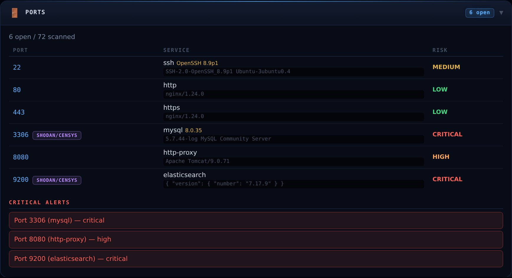</p>

</details>

<details>
<summary><b>🗺️ Subdomain Discovery — 4 passive sources + CT logs</b> &nbsp;·&nbsp; <code>subdomains</code></summary>

Queries **crt.sh**, **HackerTarget**, **RapidDNS**, and **AlienVault OTX** simultaneously, cross-references with Certificate Transparency logs, resolves every result, checks if it's alive, and flags anything that looks sensitive.

<p align="center">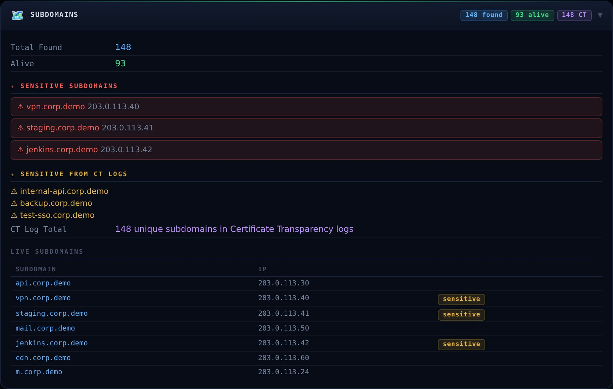</p>

</details>

<details>
<summary><b>🔨 Subdomain Brute Force</b> &nbsp;·&nbsp; <code>brute</code></summary>

Tests thousands of common subdomain names via DNS with wildcard detection — eliminates false positives automatically. Finds subdomains that passive sources miss entirely.

<p align="center">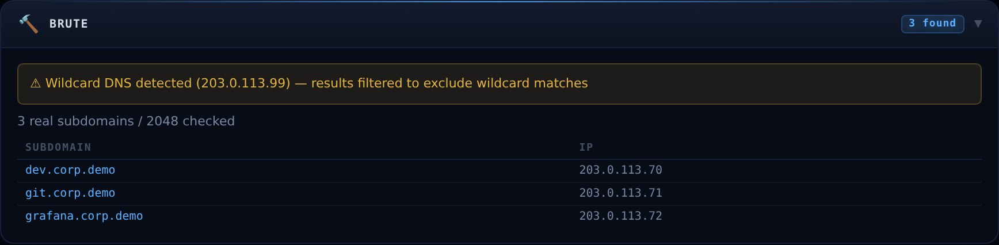</p>

</details>

<details>
<summary><b>🎯 Favicon Hash — tech fingerprint</b> &nbsp;·&nbsp; <code>favicon</code></summary>

Fetches the favicon (HTML-declared first, then common paths in parallel — bounded so it never hangs), computes the **MMH3 hash** used by Shodan/Censys, and maps known hashes to technologies. Handy for fingerprinting the stack and pivoting to other hosts running the same favicon.

<p align="center">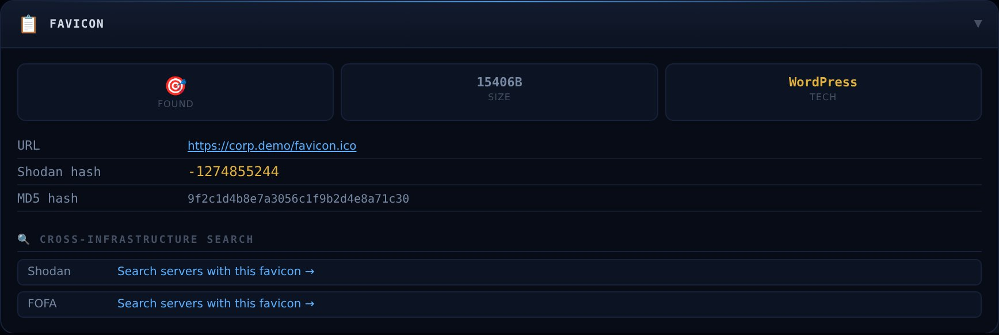</p>

</details>

---

### Web Application Analysis

<details>
<summary><b>🖼️ Screenshot — Website overview</b> &nbsp;·&nbsp; <code>screenshot</code></summary>

Takes a live screenshot of the target and runs it against the **ransomware.live** feed. Pulls the page title, meta description, favicon, CMS fingerprint, and checks whether the domain appears in any ransomware gang's leak posts.

<p align="center">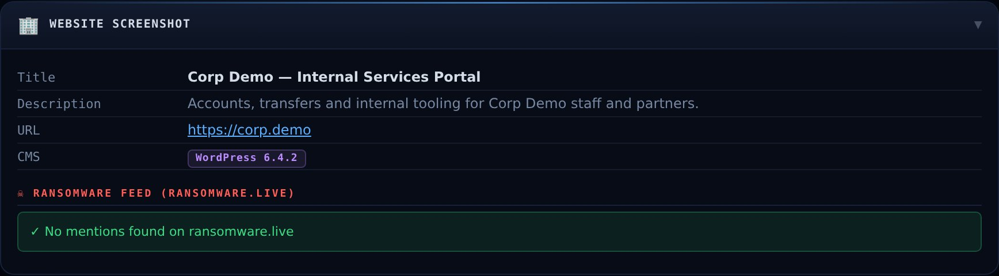</p>

</details>

<details>
<summary><b>🕵️ WhatWeb — Technology fingerprinting</b> &nbsp;·&nbsp; <code>whatweb</code></summary>

Identifies the full tech stack — CMS, frameworks, JavaScript libraries, analytics, CDN, server, and more. Runs 80+ signature checks without sending a single intrusive request.

<p align="center">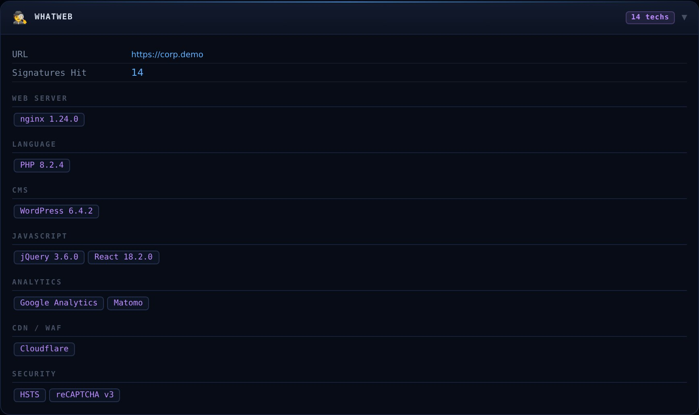</p>

</details>

<details>
<summary><b>🤖 Robots / Security — Crawl rules + disclosure</b> &nbsp;·&nbsp; <code>robots</code></summary>

Parses `robots.txt` for disallowed and allowed paths, highlights sensitive ones, and checks for a `security.txt` vulnerability disclosure contact. Also discovers sitemaps.

<p align="center">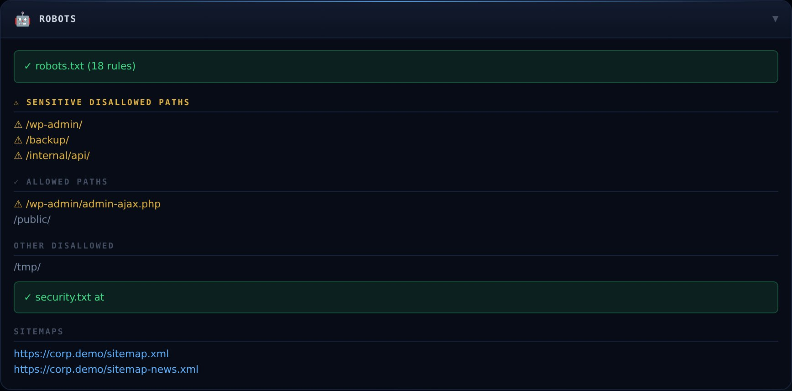</p>

</details>

<details>
<summary><b>📚 Wayback Machine — Archive mining</b> &nbsp;·&nbsp; <code>wayback</code></summary>

Queries the Wayback Machine for archived snapshots of the target — mining old endpoints, forgotten login pages, exposed config files, and paths that no longer exist on the live site but reveal the attack surface history.

<p align="center">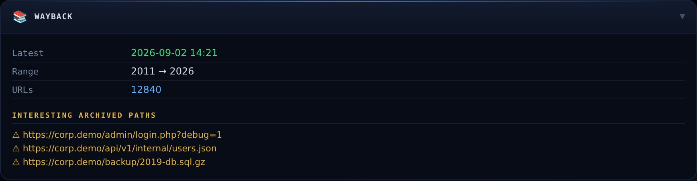</p>

</details>

<details>
<summary><b>🧠 Content Intelligence — JS/HTML extraction</b> &nbsp;·&nbsp; <code>content_intel</code></summary>

Scrapes the homepage HTML, inline scripts, and every first-party JS file, then extracts the **valuable** signal — not just secrets. Endpoints, internal/external URLs, API routes, **database connection URIs**, cloud storage (S3 / GCS / Azure / Firebase), emails, internal hosts, JWTs, private keys, source maps, and risky code comments. Static assets (`.css`, `.js`, images, fonts) and documentation domains (MDN, W3C) are filtered out; external URLs are collapsed to unique third-party hosts.

<p align="center">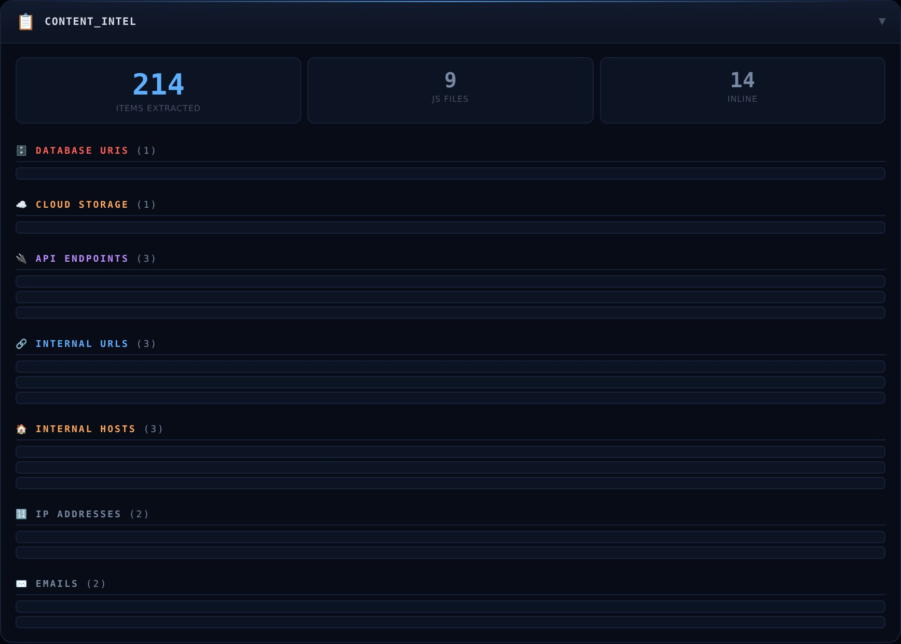</p>

</details>

<details>
<summary><b>🔎 HTTP Inspector — request/response headers</b> &nbsp;·&nbsp; <code>http_inspect</code></summary>

Your browser's DevTools *Network* tab, headless. Shows exactly what Kumo sent and exactly what came back — the full request headers, every response header verbatim, the complete redirect chain, cookie security flags, allowed HTTP methods, CORS behaviour, and any non-standard or leaky headers worth a second look.

<p align="center">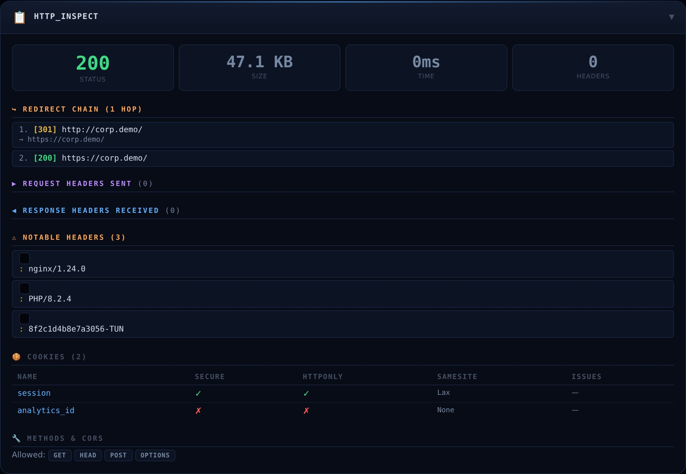</p>

</details>

<details>
<summary><b>🔌 API Endpoint Fuzzer</b> &nbsp;·&nbsp; <code>api_fuzzer</code></summary>

Smart API discovery. Probes a random baseline first to detect catch-all servers, confirms a base API path actually exists before fuzzing, then discovers live endpoints and checks for **GraphQL introspection**. Every hit shows its HTTP status and response **byte size**.

<p align="center">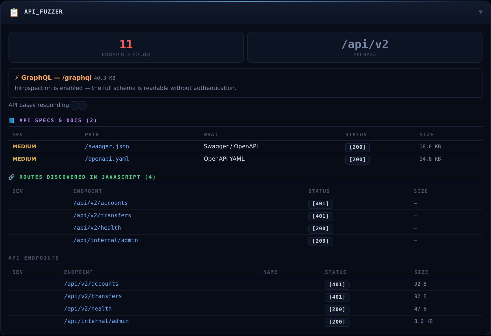</p>

</details>

<details>
<summary><b>🔑 JS Secret Scanner</b> &nbsp;·&nbsp; <code>js_secrets</code></summary>

Pulls and scans first-party JavaScript for hardcoded secrets — API keys, tokens, cloud credentials, and private keys — with clear-text output and the exact source line for each hit.

<p align="center">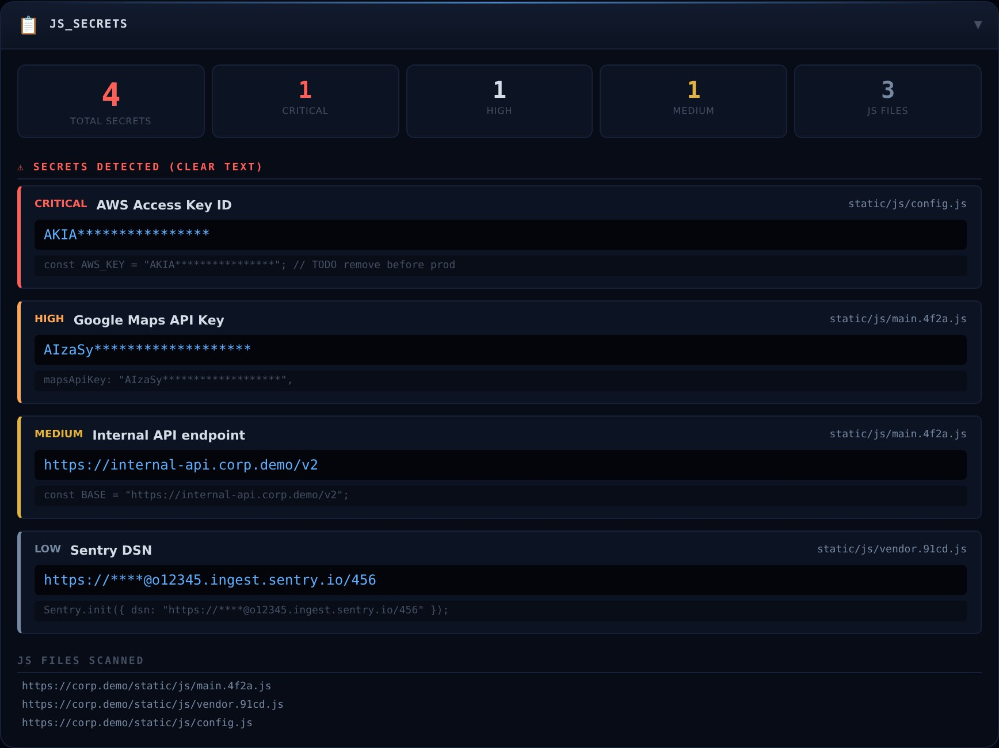</p>

</details>

<details>
<summary><b>🔓 Sensitive Endpoint Discovery — 80+ known paths</b> &nbsp;·&nbsp; <code>endpoints</code></summary>

Probes 80+ paths that are commonly left exposed: admin panels, backup files, config files, debug interfaces, API docs, source control, and infrastructure files. Every hit is severity-graded. A `403 Forbidden` response still confirms the path exists and is automatically downgraded one severity level.

<p align="center">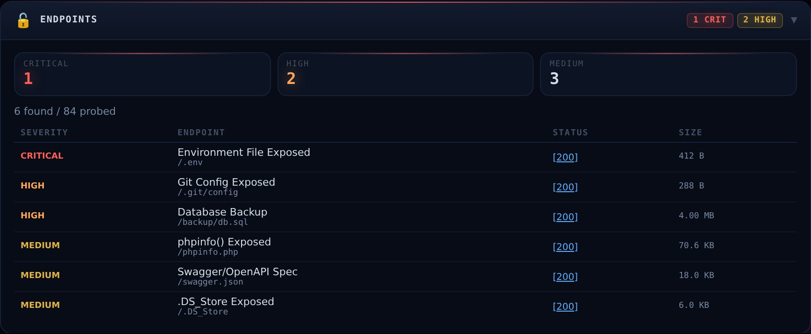</p>

</details>

---

### Security & Threat Intelligence

<details>
<summary><b>🛡️ HTTP Headers — Security grade</b> &nbsp;·&nbsp; <code>headers</code></summary>

Checks every security-relevant response header and grades the configuration. Flags missing headers that leave the site open to XSS, clickjacking, MIME sniffing, and information disclosure.

<p align="center">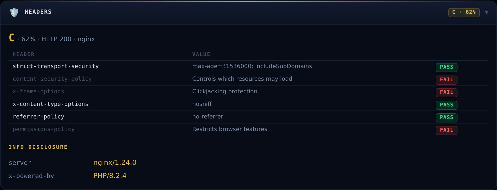</p>

</details>

<details>
<summary><b>🧱 WAF Detection</b> &nbsp;·&nbsp; <code>wafw00f</code></summary>

Fingerprints the WAF or CDN sitting in front of the target using 40+ signatures — headers, cookies, server banners, and active probe responses. If nothing is detected, it says so clearly.

<p align="center">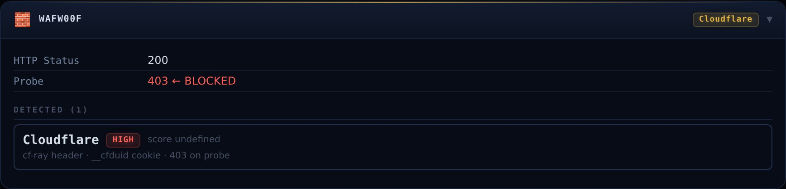</p>

</details>

<details>
<summary><b>🔓 Vulnerability Scanner — 358 built-in checks</b> &nbsp;·&nbsp; <code>nuclei</code></summary>

Pure Python, zero external tools. A **nuclei-style rule playbook of 358 rules** with real `matchers` / `matchers-condition: and`, each pairing *product identification* with *vulnerability evidence* — never a bare status code. 30 rules are hand-written; **328 are ported directly from the official [nuclei-templates](https://github.com/projectdiscovery/nuclei-templates) repository**, covering Drupal, Joomla, Magento, TYPO3, Sitecore, Umbraco, OpenCart, Confluence, SharePoint, Jira, Airflow, Jupyter, etcd, Consul, Keycloak, Rancher, Portainer, Artifactory, Zabbix, Nagios, Spring, Symfony, Django, Laravel, Tomcat, Redis, Elasticsearch, Kubernetes and Docker. Every ported rule is replayed against eight decoy responses (soft-404, WAF 403, marketing homepage, SPA shell, empty 200, JSON error, redirect, generic login) and discarded if it fires on any of them. Plus 150+ HTTP-based checks inspired by real Nuclei templates — covering known CVEs, CMS vulnerabilities, exposed admin panels, cloud metadata endpoints, CI/CD dashboards, CORS misconfigurations, and more. Every check is **catch-all / WAF aware**: a baseline is fingerprinted first, so the generic 403/404 page a host returns for every path is never reported as a finding. Raw-file checks (`.git`, `.env`, backups) require the *actual* file content, and 403 responses are downgraded — never reported as "exposed". **Soft-404 aware**: sites that answer unknown paths with HTTP 200 and a friendly "page not found" page (very common on e-commerce and SPAs) are detected and discarded, and the requested path is scrubbed from the response before product matching — so a URL echoed back in an error page or redirect can never be mistaken for the product itself.

<p align="center">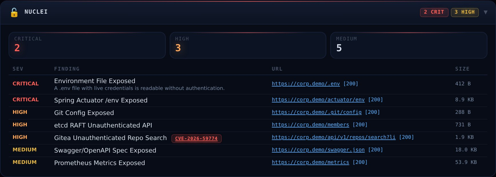</p>

Checks include: **Log4Shell · Spring4Shell · Drupalgeddon2 · Confluence OGNL · Oracle WebLogic · 15 WordPress plugin CVEs · CORS misconfiguration · Host header injection · Clickjacking** and many more.

**Recent CVE detection (2024–2026)** — a dedicated set of *detection-only* templates fingerprints exposure/version for the newest, actively-exploited CVEs (no exploitation, just correlation):

```
  RECENT CVE  cPanel / WHM Login Panel Exposed     CVE-2026-41940
  RECENT CVE  Next.js Middleware Auth Bypass       CVE-2025-29927
  RECENT CVE  SharePoint "ToolShell" RCE           CVE-2025-53770
  RECENT CVE  SAP NetWeaver Visual Composer        CVE-2025-31324
  RECENT CVE  Ivanti EPMM / Connect Secure         CVE-2025-4427
  RECENT CVE  CrushFTP Auth Bypass                 CVE-2025-31161
  ... 15 more (Fortinet · Palo Alto · Oracle EBS · Craft CMS · Vite · Langflow · Wazuh)
```

</details>

<details>
<summary><b>🔭 Shodan — InternetDB + CVE enrichment</b> &nbsp;·&nbsp; <code>shodan</code></summary>

Queries Shodan InternetDB (free, no key) for open ports, CPEs, hostnames, and CVEs. Every CVE is enriched with CVSS score, severity, KEV flag, and description via Shodan's free CVEDB API.

<p align="center">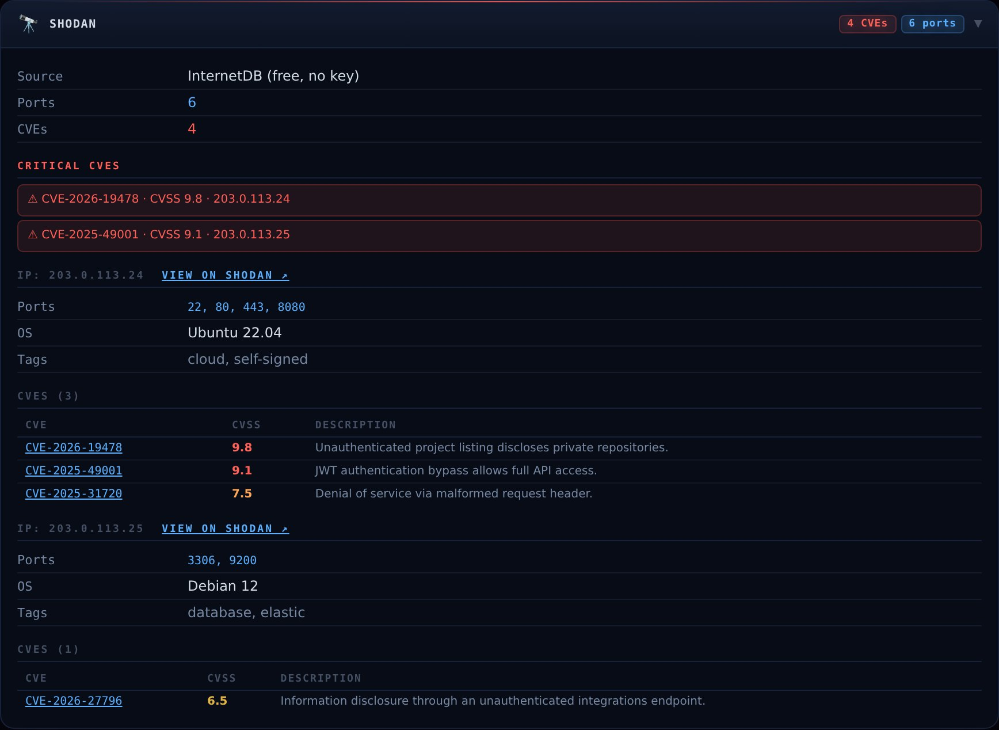</p>

</details>

<details>
<summary><b>🔬 Censys — Hosts + certificates</b> &nbsp;·&nbsp; <code>censys</code></summary>

Pulls host data and certificate intelligence from Censys. Enriched with optional API key for full results.

<p align="center">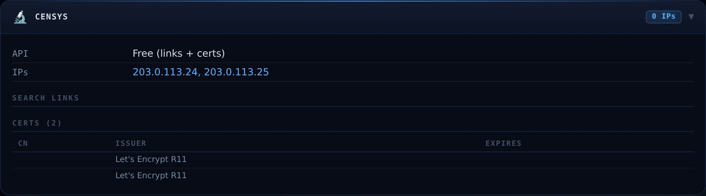</p>

</details>

<details>
<summary><b>💀 Breach & Credential Intelligence — 5 sources</b> &nbsp;·&nbsp; <code>breachintel</code></summary>

Aggregates from **5 free sources** and runs an automatic per-email stealer check against Hudson Rock's database — showing which employee machines were infected, what malware ran, what passwords were stolen, and which services were compromised.

<p align="center">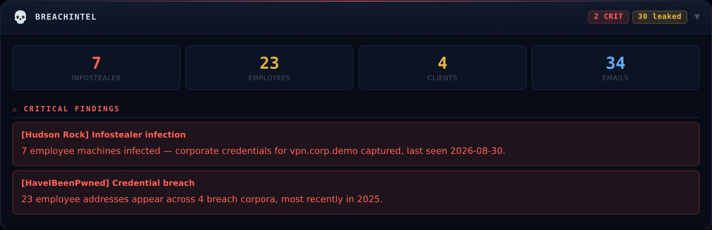</p>

</details>

<details>
<summary><b>📧 Email Harvester</b> &nbsp;·&nbsp; <code>email_harvest</code></summary>

Discovers `@domain` employee email addresses across multiple open sources, then merges in every confirmed email found during the breach intelligence scan.

<p align="center">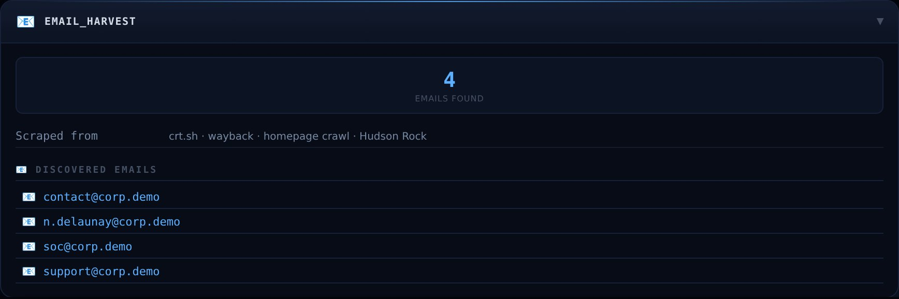</p>

Sources: **Hunter.io** · **crt.sh** certificate logs · web page scraping (contact / about / team) · **DNS SOA** record · **WHOIS** contact · **Wayback Machine** archive · common business prefixes.

</details>

<details>
<summary><b>☁️ Cloud Storage Buckets</b> &nbsp;·&nbsp; <code>cloud_buckets</code></summary>

Enumerates likely **AWS S3 / GCP / Azure** bucket names derived from the domain and checks for public exposure. Only a confirmed **HTTP 200 (publicly readable)** is reported — unreliable 403 responses are never flagged as findings.

<p align="center">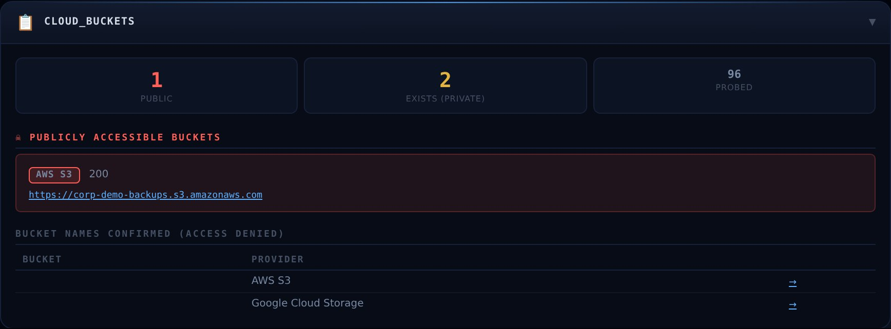</p>

</details>

<details>
<summary><b>🔍 Google Dorks — 61 queries</b> &nbsp;·&nbsp; <code>dorks</code></summary>

Generates 61 targeted Google dork queries pre-built for the domain — one click opens them in Google. Covers exposed files, login pages, sensitive directories, subdomains, cached pages, code repositories, and more.

<p align="center">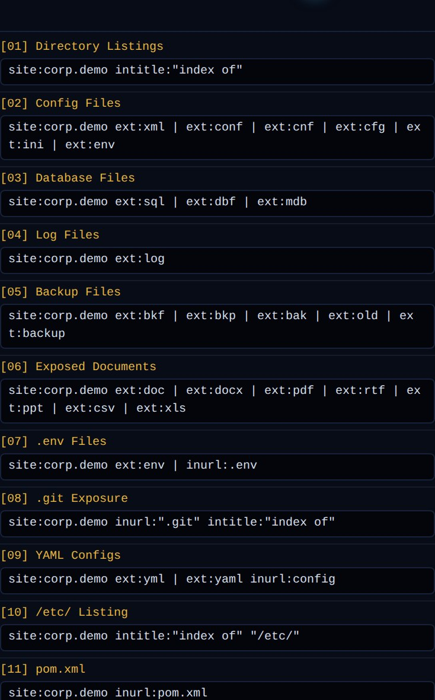</p>

</details>

<details>
<summary><b>🔗 OSINT Platform Links — 26 sources</b> &nbsp;·&nbsp; <code>osint</code></summary>

Pre-generates 26 investigation links for the target across the most useful OSINT platforms — one click and you're there.

<p align="center">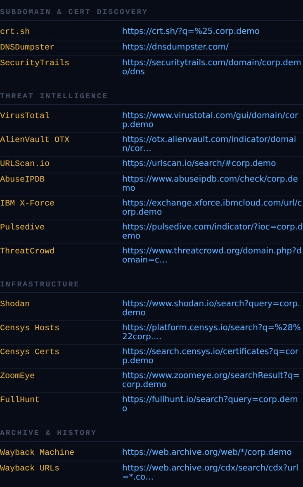</p>

---

</details>

---
## ⚙️ Optional API keys

Everything above works with no key at all. These only unlock richer data:

| Variable | Unlocks |
|---|---|
| `SHODAN_API_KEY` | full Shodan host data — banners, services, history |
| `CENSYS_API_ID` + `CENSYS_API_SECRET` | full Censys host & certificate search |
| `HIBP_API_KEY` | per-email HaveIBeenPwned lookup |
| `CHIASMODON_API_KEY` | Chiasmodon pro tier — more results |
| `RANSOMWARE_LIVE_API_KEY` | Ransomware.live pro feed |
| `GOOGLE_CSE_KEY` + `GOOGLE_CSE_ID` | execute the generated dorks live |

```bash
export SHODAN_API_KEY="your_key_here"
# read at run time — never written to disk
```

---

## 📟 CLI reference

```
python3 kumo.py                               home screen — pick modules by number
python3 kumo.py example.com                   full scan
python3 kumo.py example.com --fast            skip the slow modules
python3 kumo.py example.com -m dns ssl ports  specific modules only
python3 kumo.py example.com -o report.json    export to JSON
python3 kumo.py --web                         web dashboard (port 8888)
python3 kumo.py --web -p 9000                 custom port
python3 kumo.py --list-modules                every module, grouped
python3 kumo.py --theme carbon example.com    void · glass · web · carbon
python3 kumo.py example.com --no-spider       disable the crawl animation
python3 kumo.py example.com --no-color        pipe-friendly output
```

| Flag | Default |
|---|---|
| `--theme` | `void`, or `$KUMO_THEME` |
| `-p` / `--port` | `8888` |
| `--host` | `0.0.0.0` |

Fast mode skips: `wayback` · `brute` · `subdomains` · `screenshot` ·
`email_harvest` · `nuclei` · `cloud_buckets`

---

## 🧪 Tests

```bash
python3 test_rules.py      # every rule fires on its fixture and on no decoy
python3 test_modules.py    # every module returns cleanly inside its budget
python3 test_live.py       # end-to-end against a real domain
```

`test_rules.py` is the one that matters. It runs each vulnerability rule
against a vulnerable fixture *and* against seven decoys, and fails if a rule
either misses its target or fires on something harmless.

---

## 🙏 Credits

Kumo collects and correlates — the data belongs to the sources below, and they
deserve the star far more than this repo does:

| Source | Used for |
|---|---|
| [crt.sh](https://crt.sh) | certificate transparency logs, subdomain discovery |
| [Shodan InternetDB](https://internetdb.shodan.io) | open ports, CVEs, host tags — free, keyless |
| [Hudson Rock](https://hudsonrock.com) | infostealer infection intelligence |
| [ProjectDiscovery](https://github.com/projectdiscovery/nuclei-templates) | the templates behind most vulnerability rules |
| [Wayback Machine](https://web.archive.org) | archived URLs and historical surface |
| [RDAP](https://rdap.org) / regional registries | registration and ASN data |
| [HaveIBeenPwned](https://haveibeenpwned.com) | breach corpus |

Respect each source's own terms of use and rate limits.

---

## 🌐 Ecosystem

| | Tool | Domain |
|---|---|---|
| ☁️ | **Kumo** 蜘蛛 | domain OSINT & reconnaissance |
| 🌑 | [**Kage** 影](https://github.com/karim852/Kage-DFIR-toolkit) | DFIR host triage |

---

> ⚠️ **For authorized security testing only.**
> Only scan domains you own or have explicit written permission to test.
> Free to use, modify and share for educational and personal purposes — please
> credit the work. Commercial use requires explicit permission from the author.

<p align="center"><sub>Built for those who move fast. 蜘蛛</sub></p>
